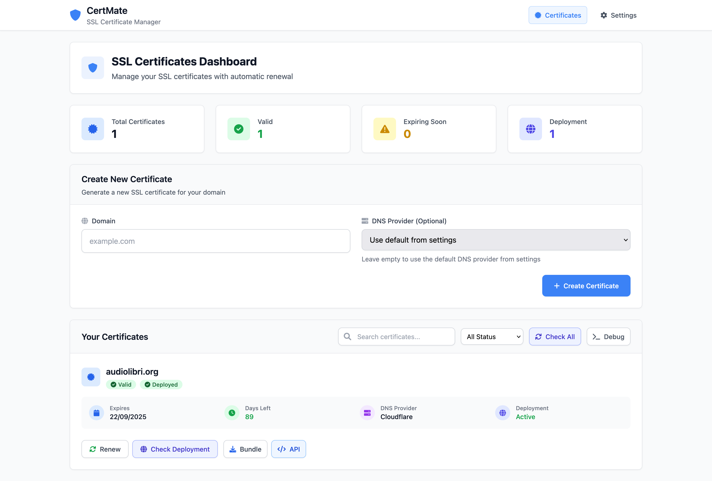

# 🔐 CertMate - SSL Certificate Management System

<div align="center">

**CertMate** is a powerful SSL certificate management system designed for modern infrastructure. Built with multi-DNS provider support, Docker containerization, and comprehensive REST API, it's the perfect solution for managing certificates across multiple datacenters and cloud environments.

[](https://opensource.org/licenses/MIT)
[](https://www.python.org/downloads/)
[](https://hub.docker.com/)
[](http://localhost:8000/docs/)




[🚀 Quick Start](#-quick-start-with-docker) • [📖 Documentation](#-documentation) • [🔧 Installation](#-installation-methods) • [🌐 DNS Providers](#-supported-dns-providers) • [📊 API Reference](#-api-usage)

</div>

---

## 🌟 Why CertMate?

CertMate solves the complexity of SSL certificate management in modern distributed architectures. Whether you're running a single application or managing certificates across multiple datacenters, CertMate provides:

- **🔄 Zero-Downtime Automation** - Certificates renew automatically 30 days before expiry
- **🌐 Multi-Cloud Support** - Works with 5+ DNS providers (Cloudflare, AWS, Azure, GCP, PowerDNS)
- **🚀 Enterprise-Ready** - Docker, Kubernetes, REST API, and monitoring built-in
- **📦 Simple Integration** - One-URL certificate downloads for easy automation
- **🔒 Security-First** - Bearer token authentication, secure file permissions, audit logging

## ✨ Key Features

### 🔐 **Certificate Management**
- **Let's Encrypt Integration** - Free, automated SSL certificates
- **Wildcard Support** - Single certificate for `*.example.com` and `example.com`
- **Multi-Domain Certificates** - SAN certificates for multiple domains
- **Automatic Renewal** - Smart renewal 30 days before expiry
- **Certificate Validation** - Real-time SSL certificate status checking

### 🌐 **Multi-DNS Provider Support**
- **Cloudflare** - Global CDN with edge locations worldwide
- **AWS Route53** - Amazon's scalable DNS service
- **Azure DNS** - Microsoft's cloud DNS solution
- **Google Cloud DNS** - Google's high-performance DNS
- **PowerDNS** - Open-source DNS server with REST API

### 🚀 **Enterprise Features**
- **REST API** - Complete programmatic control with Swagger/OpenAPI docs
- **Web Dashboard** - Modern, responsive UI built with Tailwind CSS
- **Docker Ready** - Full containerization with Docker Compose
- **Kubernetes Compatible** - Deploy in any Kubernetes cluster
- **High Availability** - Stateless design for horizontal scaling
- **Monitoring Integration** - Health checks and structured logging

### � **Security & Compliance**
- **Bearer Token Authentication** - Secure API access control
- **File Permissions** - Proper certificate file security (600/700)
- **Audit Logging** - Complete certificate lifecycle tracking
- **Environment Variables** - Secure credential management
- **Rate Limit Handling** - Let's Encrypt rate limit awareness

### � **Developer Experience**
- **One-URL Downloads** - Simple certificate retrieval for automation
- **Multiple Output Formats** - PEM, ZIP, individual files
- **SDK Examples** - Python, Bash, Ansible, Terraform examples
- **Webhook Support** - Certificate renewal notifications
- **Extensive Documentation** - API docs, guides, and examples

## 🌐 Supported DNS Providers

CertMate supports all major DNS providers through Let's Encrypt DNS-01 challenge. Choose the provider that best fits your infrastructure:

| Provider | Plugin Version | Credentials Required | Use Case | Status |
|----------|---------------|---------------------|----------|---------|
| **🔶 Cloudflare** | `certbot-dns-cloudflare==4.1.1` | API Token | Global CDN, Free tier available | ✅ **Stable** |
| **🟠 AWS Route53** | `certbot-dns-route53==4.1.1` | Access Key, Secret Key | AWS infrastructure, Enterprise | ✅ **Stable** |
| **🔵 Azure DNS** | `certbot-dns-azure==2.6.1` | Service Principal credentials | Microsoft ecosystem | ✅ **Stable** |
| **🟢 Google Cloud DNS** | `certbot-dns-google==4.1.1` | Service Account JSON | Google Cloud Platform | ✅ **Stable** |
| **⚫ PowerDNS** | `certbot-dns-powerdns==0.2.1` | API URL, API Key | Self-hosted, On-premises | ✅ **Stable** |

### � Provider-Specific Features

- **Cloudflare**: Global edge locations, DDoS protection, free tier
- **Route53**: AWS integration, health checks, geolocation routing
- **Azure DNS**: Microsoft ecosystem, private DNS zones
- **Google Cloud DNS**: Global anycast network, DNSSEC support
- **PowerDNS**: Self-hosted control, advanced DNS features

> 📚 **Detailed Setup Instructions**: See [DNS_PROVIDERS.md](DNS_PROVIDERS.md) for provider-specific configuration.  
> 🔧 **Step-by-Step Installation**: See [INSTALLATION.md](INSTALLATION.md) for complete setup guide.

## 🚀 Quick Start with Docker

Get CertMate running in under 5 minutes with Docker Compose:

### Prerequisites
- Docker 20.10+
- Docker Compose 2.0+
- Domain with DNS managed by supported provider

### 1. Clone and Setup

```bash
# Clone the repository
git clone https://github.com/fabriziosalmi/certmate.git
cd certmate

# Copy environment template
cp .env.example .env
```

### 2. Configure Environment

Edit `.env` file with your credentials:

```bash
# 🔒 Required: API Security
API_BEARER_TOKEN=your_super_secure_api_token_here_change_this

# 🌐 DNS Provider Configuration (choose one or multiple)

# Option 1: Cloudflare (Recommended for beginners)
CLOUDFLARE_TOKEN=your_cloudflare_api_token_here

# Option 2: AWS Route53
# AWS_ACCESS_KEY_ID=your_aws_access_key
# AWS_SECRET_ACCESS_KEY=your_aws_secret_key
# AWS_DEFAULT_REGION=us-east-1

# Option 3: Azure DNS
# AZURE_SUBSCRIPTION_ID=your_azure_subscription_id
# AZURE_RESOURCE_GROUP=your_resource_group
# AZURE_TENANT_ID=your_tenant_id
# AZURE_CLIENT_ID=your_client_id
# AZURE_CLIENT_SECRET=your_client_secret

# Option 4: Google Cloud DNS
# GOOGLE_PROJECT_ID=your_gcp_project_id
# GOOGLE_APPLICATION_CREDENTIALS=/path/to/service-account.json

# Option 5: PowerDNS
# POWERDNS_API_URL=https://your-powerdns-server:8081
# POWERDNS_API_KEY=your_powerdns_api_key

# ⚙️ Optional: Application Settings
SECRET_KEY=your_flask_secret_key_here
FLASK_ENV=production
HOST=0.0.0.0
PORT=8000
```

### 3. Deploy

```bash
# Start all services
docker-compose up -d

# Check status
docker-compose ps

# View logs
docker-compose logs -f certmate
```

### 4. Access CertMate

| Service | URL | Description |
|---------|-----|-------------|
| **Web Dashboard** | http://localhost:8000 | Main certificate management interface |
| **API Documentation** | http://localhost:8000/docs/ | Interactive Swagger/OpenAPI docs |
| **Alternative API Docs** | http://localhost:8000/redoc/ | ReDoc documentation |
| **Health Check** | http://localhost:8000/health | Service health monitoring |

### 5. Create Your First Certificate

Using the Web Interface:
1. Navigate to http://localhost:8000
2. Go to Settings and configure your DNS provider
3. Add your domain (e.g. `example.com`)
4. Click "Create Certificate"

Using the API:
```bash
curl -X POST "http://localhost:8000/api/certificates/create" \
  -H "Authorization: Bearer your_api_token_here" \
  -H "Content-Type: application/json" \
  -d '{"domain": "example.com"}'
```

## 📋 Installation Methods

Choose the installation method that best fits your environment:

### 🐳 Docker (Recommended)
Perfect for production deployments with isolation and easy scaling.

```bash
# Quick start with Docker Compose
git clone https://github.com/fabriziosalmi/certmate.git
cd certmate
cp .env.example .env
# Edit .env with your configuration
docker-compose up -d
```

### 🐍 Python Virtual Environment
Ideal for development and testing environments.

```bash
# Create and activate virtual environment
python3 -m venv certmate-env
source certmate-env/bin/activate  # On Windows: certmate-env\Scripts\activate

# Install dependencies
git clone https://github.com/fabriziosalmi/certmate.git
cd certmate
pip install -r requirements.txt

# Set environment variables
export API_BEARER_TOKEN="your_token_here"
export CLOUDFLARE_TOKEN="your_cloudflare_token"

# Run the application
python app.py
```

### ☸️ Kubernetes
For container orchestration and high availability deployments.

```yaml
# Example Kubernetes deployment
apiVersion: apps/v1
kind: Deployment
metadata:
  name: certmate
spec:
  replicas: 2
  selector:
    matchLabels:
      app: certmate
  template:
    metadata:
      labels:
        app: certmate
    spec:
      containers:
      - name: certmate
        image: certmate:latest
        ports:
        - containerPort: 8000
        env:
        - name: API_BEARER_TOKEN
          valueFrom:
            secretKeyRef:
              name: certmate-secrets
              key: api-token
        volumeMounts:
        - name: certificates
          mountPath: /app/certificates
      volumes:
      - name: certificates
        persistentVolumeClaim:
          claimName: certmate-certificates
```

### 📦 System Package Installation
For system-wide installation on Linux distributions.

```bash
# Install system dependencies (Ubuntu/Debian)
sudo apt update
sudo apt install python3 python3-pip python3-venv certbot openssl

# Clone and install
git clone https://github.com/fabriziosalmi/certmate.git
sudo mv certmate /opt/
cd /opt/certmate
sudo pip3 install -r requirements.txt

# Create systemd service
sudo cp certmate.service /etc/systemd/system/
sudo systemctl enable certmate
sudo systemctl start certmate
```

> 📖 **Detailed Instructions**: See [INSTALLATION.md](INSTALLATION.md) for complete setup guides for each method.

## 📊 API Usage

CertMate provides a comprehensive REST API for programmatic certificate management. All endpoints require Bearer token authentication.

### 🔐 Authentication

Include the Authorization header in all API requests:

```bash
Authorization: Bearer your_api_token_here
```

### 📍 Core Endpoints

#### Health & Status
```bash
# Health check
GET /health

# API documentation
GET /docs/          # Swagger UI
GET /redoc/         # ReDoc documentation
```

#### Settings Management
```bash
# Get current settings
GET /api/settings
Authorization: Bearer your_token_here

# Update settings
POST /api/settings
Authorization: Bearer your_token_here
Content-Type: application/json

{
  "dns_provider": "cloudflare",
  "dns_providers": {
    "cloudflare": {
      "api_token": "your_cloudflare_token"
    }
  },
  "domains": [
    {
      "domain": "example.com",
      "dns_provider": "cloudflare"
    }
  ],
  "email": "admin@example.com",
  "auto_renew": true
}
```

#### Certificate Management
```bash
# List all certificates
GET /api/certificates
Authorization: Bearer your_token_here

# Create new certificate
POST /api/certificates/create
Authorization: Bearer your_token_here
Content-Type: application/json

{
  "domain": "example.com",
  "dns_provider": "cloudflare"  # Optional, uses default from settings
}

# Renew certificate
POST /api/certificates/example.com/renew
Authorization: Bearer your_token_here

# Download certificate (ZIP format)
GET /api/certificates/example.com/download
Authorization: Bearer your_token_here

# Check certificate deployment status
GET /api/certificates/example.com/deployment-status
Authorization: Bearer your_token_here
```

### 🎯 Automation-Friendly Download URL

**The most powerful feature for infrastructure automation:**

```bash
# Download certificates via simple URL pattern
GET /{domain}/tls
Authorization: Bearer your_token_here
```

This endpoint returns a ZIP file containing all certificate files:
- `cert.pem` - Server certificate
- `chain.pem` - Intermediate certificate chain  
- `fullchain.pem` - Full certificate chain (cert + chain)
- `privkey.pem` - Private key

### 💼 Integration Examples

#### cURL Download
```bash
curl -H "Authorization: Bearer your_token_here" \
     -o example.com-tls.zip \
     https://your-certmate-server.com/example.com/tls
```

#### Python SDK Example
```python
import requests
import zipfile
from pathlib import Path

class CertMateClient:
    def __init__(self, base_url, token):
        self.base_url = base_url.rstrip('/')
        self.headers = {"Authorization": f"Bearer {token}"}
    
    def download_certificate(self, domain, extract_to=None):
        """Download and optionally extract certificate for domain"""
        url = f"{self.base_url}/{domain}/tls"
        
        response = requests.get(url, headers=self.headers)
        response.raise_for_status()
        
        zip_path = f"{domain}-tls.zip"
        with open(zip_path, 'wb') as f:
            f.write(response.content)
        
        if extract_to:
            Path(extract_to).mkdir(parents=True, exist_ok=True)
            with zipfile.ZipFile(zip_path, 'r') as zip_ref:
                zip_ref.extractall(extract_to)
        
        return zip_path
    
    def list_certificates(self):
        """List all managed certificates"""
        response = requests.get(f"{self.base_url}/api/certificates", 
                              headers=self.headers)
        response.raise_for_status()
        return response.json()
    
    def create_certificate(self, domain, dns_provider=None):
        """Create new certificate for domain"""
        data = {"domain": domain}
        if dns_provider:
            data["dns_provider"] = dns_provider
            
        response = requests.post(f"{self.base_url}/api/certificates/create",
                               json=data, headers=self.headers)
        response.raise_for_status()
        return response.json()
    
    def renew_certificate(self, domain):
        """Renew existing certificate"""
        response = requests.post(f"{self.base_url}/api/certificates/{domain}/renew",
                               headers=self.headers)
        response.raise_for_status()
        return response.json()

# Usage example
client = CertMateClient("https://certmate.company.com", "your_token_here")

# Download certificate
client.download_certificate("api.company.com", extract_to="/etc/ssl/certs/api/")

# List all certificates
certs = client.list_certificates()
for cert in certs:
    print(f"Domain: {cert['domain']}, Expires: {cert['expiry_date']}")
```

#### Infrastructure as Code Examples

**Terraform Provider Example:**
```hcl
# Configure the CertMate provider
terraform {
  required_providers {
    certmate = {
      source = "local/certmate"
      version = "~> 1.0"
    }
  }
}

provider "certmate" {
  endpoint = "https://certmate.company.com"
  token    = var.certmate_token
}

# Create certificates for multiple domains
resource "certmate_certificate" "api" {
  domain       = "api.company.com"
  dns_provider = "cloudflare"
}

resource "certmate_certificate" "web" {
  domain       = "web.company.com" 
  dns_provider = "route53"
}

# Download certificates to local files
data "certmate_certificate_download" "api" {
  domain = certmate_certificate.api.domain
}

# Use in nginx configuration
resource "kubernetes_secret" "api_tls" {
  metadata {
    name      = "api-tls"
    namespace = "default"
  }
  
  type = "kubernetes.io/tls"
  
  data = {
    "tls.crt" = data.certmate_certificate_download.api.fullchain_pem
    "tls.key" = data.certmate_certificate_download.api.private_key_pem
  }
}
```
**Bash Automation Script:**
```bash
#!/bin/bash
set -euo pipefail

# Configuration
CERTMATE_URL="https://certmate.company.com"
API_TOKEN="${CERTMATE_TOKEN}"
DOMAIN="${1:-example.com}"
CERT_DIR="/etc/ssl/certs/${DOMAIN}"
BACKUP_DIR="/backup/certs/${DOMAIN}/$(date +%Y%m%d_%H%M%S)"

# Functions
log() {
    echo "[$(date +'%Y-%m-%d %H:%M:%S')] $*" >&2
}

create_backup() {
    if [[ -d "$CERT_DIR" ]]; then
        log "Creating backup of existing certificates"
        mkdir -p "$BACKUP_DIR"
        cp -r "$CERT_DIR"/* "$BACKUP_DIR/" || true
    fi
}

download_certificate() {
    log "Downloading certificate for ${DOMAIN}"
    
    # Download with retry logic
    for i in {1..3}; do
        if curl -f -H "Authorization: Bearer $API_TOKEN" \
                -o "${DOMAIN}-tls.zip" \
                "$CERTMATE_URL/$DOMAIN/tls"; then
            log "Certificate downloaded successfully"
            return 0
        else
            log "Download attempt $i failed, retrying..."
            sleep 5
        fi
    done
    
    log "Failed to download certificate after 3 attempts"
    return 1
}

extract_certificate() {
    log "Extracting certificate to ${CERT_DIR}"
    mkdir -p "$CERT_DIR"
    unzip -o "${DOMAIN}-tls.zip" -d "$CERT_DIR"
    
    # Set proper permissions
    chmod 600 "$CERT_DIR"/*.pem
    chown root:ssl-cert "$CERT_DIR"/*.pem
}

reload_services() {
    log "Reloading web services"
    systemctl reload nginx || log "Failed to reload nginx"
    systemctl reload apache2 || log "Failed to reload apache2"
    systemctl reload haproxy || log "Failed to reload haproxy"
}

cleanup() {
    rm -f "${DOMAIN}-tls.zip"
}

# Main execution
main() {
    log "Starting certificate update for ${DOMAIN}"
    
    create_backup
    download_certificate
    extract_certificate
    reload_services
    cleanup
    
    log "Certificate update completed for ${DOMAIN}"
}

# Trap cleanup on exit
trap cleanup EXIT

# Run main function
main "$@"
```

**Advanced Ansible Playbook:**
```yaml
---
- name: Manage SSL certificates with CertMate
  hosts: web_servers
  become: yes
  vars:
    certmate_url: "https://certmate.company.com"
    api_token: "{{ vault_certmate_token }}"
    certificate_domains:
      - name: "api.company.com"
        dns_provider: "cloudflare"
        nginx_sites: ["api"]
        services_to_reload: ["nginx"]
      - name: "web.company.com"
        dns_provider: "route53"
        nginx_sites: ["web", "admin"]
        services_to_reload: ["nginx", "haproxy"]
  
  tasks:
    - name: Create certificate directories
      file:
        path: "/etc/ssl/certs/{{ item.name }}"
        state: directory
        owner: root
        group: ssl-cert
        mode: '0750'
      loop: "{{ certificate_domains }}"
      
    - name: Check certificate expiry
      uri:
        url: "{{ certmate_url }}/api/certificates/{{ item.name }}/deployment-status"
        method: GET
        headers:
          Authorization: "Bearer {{ api_token }}"
      register: cert_status
      loop: "{{ certificate_domains }}"
      
    - name: Create new certificates if needed
      uri:
        url: "{{ certmate_url }}/api/certificates/create"
        method: POST
        headers:
          Authorization: "Bearer {{ api_token }}"
          Content-Type: "application/json"
        body_format: json
        body:
          domain: "{{ item.name }}"
          dns_provider: "{{ item.dns_provider }}"
      loop: "{{ certificate_domains }}"
      when: cert_status.results[ansible_loop.index0].json.needs_renewal | default(false)
      
    - name: Download certificates
      uri:
        url: "{{ certmate_url }}/{{ item.name }}/tls"
        method: GET
        headers:
          Authorization: "Bearer {{ api_token }}"
        dest: "/tmp/{{ item.name }}-tls.zip"
        creates: "/tmp/{{ item.name }}-tls.zip"
      loop: "{{ certificate_domains }}"
      
    - name: Extract certificates
      unarchive:
        src: "/tmp/{{ item.name }}-tls.zip"
        dest: "/etc/ssl/certs/{{ item.name }}/"
        owner: root
        group: ssl-cert
        mode: '0640'
        remote_src: yes
      loop: "{{ certificate_domains }}"
      notify: 
        - reload nginx
        - reload haproxy
        - restart services
      
    - name: Verify certificate installation
      openssl_certificate:
        path: "/etc/ssl/certs/{{ item.name }}/fullchain.pem"
        provider: assertonly
        has_expired: no
        valid_in: 86400  # Valid for at least 1 day
      loop: "{{ certificate_domains }}"
      
    - name: Update nginx SSL configuration
      template:
        src: "nginx-ssl.conf.j2"
        dest: "/etc/nginx/sites-available/{{ item.1 }}"
        backup: yes
      loop: "{{ certificate_domains | subelements('nginx_sites') }}"
      notify: reload nginx
      
    - name: Cleanup temporary files
      file:
        path: "/tmp/{{ item.name }}-tls.zip"
        state: absent
      loop: "{{ certificate_domains }}"
  
  handlers:
    - name: reload nginx
      systemd:
        name: nginx
        state: reloaded
        
    - name: reload haproxy
      systemd:
        name: haproxy
        state: reloaded
        
    - name: restart services
      systemd:
        name: "{{ item }}"
        state: restarted
      loop: "{{ services_to_restart | default([]) }}"
```

## ⚙️ Configuration Guide

### 🔧 Environment Variables

| Variable | Required | Default | Description |
|----------|----------|---------|-------------|
| `API_BEARER_TOKEN` | ✅ | - | Bearer token for API authentication |
| `SECRET_KEY` | ❌ | auto-generated | Flask secret key for sessions |
| `HOST` | ❌ | `127.0.0.1` | Server bind address |
| `PORT` | ❌ | `8000` | Server port |
| `FLASK_ENV` | ❌ | `production` | Flask environment |
| `FLASK_DEBUG` | ❌ | `false` | Enable debug mode |

### 🌐 DNS Provider Configuration

#### Cloudflare Setup
1. Go to [Cloudflare API Tokens](https://dash.cloudflare.com/profile/api-tokens)
2. Click "Create Token" → "Custom token"
3. Set permissions:
   - **Zone**: `DNS:Edit` + `Zone:Read`
   - **Zone Resources**: Include specific zones or all zones
4. Copy the generated token

```bash
# Environment variable
CLOUDFLARE_TOKEN=your_cloudflare_api_token_here
```

#### AWS Route53 Setup
1. Create IAM user with Route53 permissions
2. Attach policy: `Route53FullAccess` or custom policy:

```json
{
    "Version": "2012-10-17",
    "Statement": [
        {
            "Effect": "Allow",
            "Action": [
                "route53:ListHostedZones",
                "route53:GetChange",
                "route53:ChangeResourceRecordSets"
            ],
            "Resource": "*"
        }
    ]
}
```

```bash
# Environment variables
AWS_ACCESS_KEY_ID=your_access_key_id
AWS_SECRET_ACCESS_KEY=your_secret_access_key
AWS_DEFAULT_REGION=us-east-1
```

#### Azure DNS Setup
1. Create Service Principal:
```bash
az ad sp create-for-rbac --name "CertMate" --role "DNS Zone Contributor" --scopes "/subscriptions/{subscription-id}/resourceGroups/{resource-group}"
```

```bash
# Environment variables
AZURE_SUBSCRIPTION_ID=your_subscription_id
AZURE_RESOURCE_GROUP=your_resource_group_name
AZURE_TENANT_ID=your_tenant_id
AZURE_CLIENT_ID=your_client_id
AZURE_CLIENT_SECRET=your_client_secret
```

#### Google Cloud DNS Setup
1. Create service account with DNS Administrator role
2. Download JSON key file

```bash
# Environment variables
GOOGLE_PROJECT_ID=your_project_id
GOOGLE_APPLICATION_CREDENTIALS=/path/to/service-account.json
```

#### PowerDNS Setup
```bash
# Environment variables
POWERDNS_API_URL=https://your-powerdns-server:8081
POWERDNS_API_KEY=your_api_key
```

### 📁 Directory Structure

```
certmate/
├── 📄 app.py                    # Main Flask application
├── 📄 requirements.txt          # Python dependencies
├── 📄 docker-compose.yml        # Docker Compose configuration
├── 📄 Dockerfile               # Container build instructions
├── 📄 nginx.conf               # Nginx reverse proxy config
├── 📄 .env.example             # Environment template
├── 📚 README.md                # This documentation
├── 📚 INSTALLATION.md          # Detailed installation guide
├── 📚 DNS_PROVIDERS.md         # DNS provider configuration
├── 📚 CONTRIBUTING.md          # Contribution guidelines
├── 📁 certificates/            # Certificate storage
│   └── 📁 {domain}/
│       ├── 🔐 cert.pem         # Server certificate
│       ├── 🔐 chain.pem        # Certificate chain
│       ├── 🔐 fullchain.pem    # Full chain
│       └── 🔐 privkey.pem      # Private key
├── 📁 data/                    # Application data
│   └── ⚙️ settings.json        # Persistent settings
├── 📁 logs/                    # Application logs
├── 📁 letsencrypt/             # Let's Encrypt working directory
│   ├── 📁 config/              # Certbot configuration
│   ├── 📁 work/                # Certbot working files
│   └── 📁 logs/                # Certbot logs
└── 📁 templates/               # Web interface templates
    ├── 🌐 index.html           # Main dashboard
    └── ⚙️ settings.html        # Settings page
```

## 🔒 Security & Best Practices

### 🛡️ Security Considerations

#### Authentication & Authorization
- **Strong Bearer Tokens**: Use cryptographically secure tokens (32+ characters)
- **Token Rotation**: Regularly rotate API tokens
- **Environment Variables**: Never commit tokens to version control
- **HTTPS Only**: Always use HTTPS in production environments
- **IP Restrictions**: Implement firewall rules to restrict access

#### Certificate Security
- **File Permissions**: Private keys stored with `600` permissions
- **Directory Permissions**: Certificate directories with `700` permissions
- **Backup Encryption**: Encrypt certificate backups
- **Access Logging**: Monitor certificate access patterns

#### Network Security
```bash
# Example firewall rules (iptables)
# Allow only specific IPs to access CertMate
iptables -A INPUT -p tcp --dport 8000 -s 10.0.0.0/8 -j ACCEPT
iptables -A INPUT -p tcp --dport 8000 -s 192.168.0.0/16 -j ACCEPT
iptables -A INPUT -p tcp --dport 8000 -j DROP
```

### ⚡ Performance Optimization

#### Production Deployment
```yaml
# docker-compose.prod.yml
version: '3.8'
services:
  certmate:
    image: certmate:latest
    deploy:
      replicas: 2
      resources:
        limits:
          cpus: '1.0'
          memory: 512M
        reservations:
          cpus: '0.5'
          memory: 256M
    environment:
      - FLASK_ENV=production
      - GUNICORN_WORKERS=4
      - GUNICORN_THREADS=2
    healthcheck:
      test: ["CMD", "curl", "-f", "http://localhost:8000/health"]
      interval: 30s
      timeout: 10s
      retries: 3
      start_period: 60s
```

#### Load Balancing with Nginx
```nginx
upstream certmate_backend {
    server certmate1:8000;
    server certmate2:8000;
    server certmate3:8000;
}

server {
    listen 443 ssl http2;
    server_name certmate.company.com;
    
    ssl_certificate /etc/ssl/certs/certmate.company.com/fullchain.pem;
    ssl_certificate_key /etc/ssl/certs/certmate.company.com/privkey.pem;
    
    location / {
        proxy_pass http://certmate_backend;
        proxy_set_header Host $host;
        proxy_set_header X-Real-IP $remote_addr;
        proxy_set_header X-Forwarded-For $proxy_add_x_forwarded_for;
        proxy_set_header X-Forwarded-Proto $scheme;
        
        # API rate limiting
        limit_req zone=api burst=10 nodelay;
    }
}
```

### 🔄 Backup & Recovery

#### Automated Backup Script
```bash
#!/bin/bash
# /opt/scripts/backup-certmate.sh

BACKUP_DIR="/backup/certmate/$(date +%Y%m%d_%H%M%S)"
CERT_DIR="/opt/certmate/certificates"
DATA_DIR="/opt/certmate/data"
RETENTION_DAYS=30

# Create backup directory
mkdir -p "$BACKUP_DIR"

# Backup certificates
tar -czf "$BACKUP_DIR/certificates.tar.gz" "$CERT_DIR"

# Backup application data
tar -czf "$BACKUP_DIR/data.tar.gz" "$DATA_DIR"

# Backup database if using external DB
# mysqldump certmate > "$BACKUP_DIR/database.sql"

# Encrypt backups
gpg --cipher-algo AES256 --compress-algo 1 --symmetric \
    --output "$BACKUP_DIR/certificates.tar.gz.gpg" \
    "$BACKUP_DIR/certificates.tar.gz"

# Cleanup old backups
find /backup/certmate -type d -mtime +$RETENTION_DAYS -exec rm -rf {} \;

echo "Backup completed: $BACKUP_DIR"
```

#### Recovery Procedure
```bash
#!/bin/bash
# Recovery from backup

BACKUP_DATE="20241225_120000"
BACKUP_DIR="/backup/certmate/$BACKUP_DATE"

# Stop services
docker-compose down

# Restore certificates
gpg --decrypt "$BACKUP_DIR/certificates.tar.gz.gpg" | \
    tar -xzf - -C /opt/certmate/

# Restore data
tar -xzf "$BACKUP_DIR/data.tar.gz" -C /opt/certmate/

# Set permissions
chown -R 1000:1000 /opt/certmate/certificates
chmod -R 700 /opt/certmate/certificates

# Start services
docker-compose up -d

echo "Recovery completed from backup: $BACKUP_DATE"
```

## 📊 Monitoring & Observability

### 🔍 Health Monitoring

#### Built-in Health Checks
```bash
# Basic health check
curl -f http://localhost:8000/health

# Detailed health with auth
curl -H "Authorization: Bearer your_token" \
     http://localhost:8000/api/certificates
```

#### Prometheus Metrics Integration
```python
# Add to app.py for Prometheus monitoring
from prometheus_client import Counter, Histogram, generate_latest

# Metrics
certificate_requests = Counter('certmate_certificate_requests_total', 
                              'Total certificate requests', ['domain', 'status'])
certificate_expiry = Histogram('certmate_certificate_expiry_days',
                              'Days until certificate expiry', ['domain'])

@app.route('/metrics')
def metrics():
    return generate_latest()
```

#### Log Aggregation
```yaml
# docker-compose.logging.yml
version: '3.8'
services:
  certmate:
    logging:
      driver: "fluentd"
      options:
        fluentd-address: localhost:24224
        tag: certmate
        fluentd-async-connect: "true"
        
  fluentd:
    image: fluent/fluentd:v1.14
    volumes:
      - ./fluentd/conf:/fluentd/etc
      - ./logs:/var/log/fluentd
    ports:
      - "24224:24224"
      - "24224:24224/udp"
```

### 📈 Grafana Dashboard Example
```json
{
  "dashboard": {
    "title": "CertMate SSL Certificate Monitoring",
    "panels": [
      {
        "title": "Certificate Expiry Status",
        "targets": [
          {
            "expr": "certmate_certificate_expiry_days < 30",
            "legendFormat": "Expiring Soon ({{domain}})"
          }
        ],
        "alert": {
          "conditions": [
            {
              "query": {"queryType": "", "refId": "A"},
              "reducer": {"type": "last", "params": []},
              "evaluator": {"params": [30], "type": "lt"}
            }
          ],
          "executionErrorState": "alerting",
          "frequency": "1h",
          "handler": 1,
          "name": "Certificate Expiring",
          "noDataState": "no_data",
          "notifications": []
        }
      }
    ]
  }
}
```

### 🚨 Alerting Configuration

#### Webhook Notifications
```python
# Add webhook notification support
import requests

def send_webhook_notification(domain, event_type, details):
    webhook_url = os.getenv('WEBHOOK_URL')
    if not webhook_url:
        return
        
    payload = {
        'domain': domain,
        'event': event_type,
        'timestamp': datetime.now().isoformat(),
        'details': details
    }
    
    try:
        requests.post(webhook_url, json=payload, timeout=10)
    except Exception as e:
        logger.error(f"Failed to send webhook: {e}")
```

#### Slack Integration Example
```bash
# Slack notification script
#!/bin/bash
SLACK_WEBHOOK="your_slack_webhook_url"
DOMAIN="$1"
STATUS="$2"
MESSAGE="Certificate for $DOMAIN: $STATUS"

curl -X POST -H 'Content-type: application/json' \
    --data "{\"text\":\"🔐 $MESSAGE\"}" \
    "$SLACK_WEBHOOK"
```

## 🔧 Troubleshooting Guide

### 🚨 Common Issues & Solutions

#### Certificate Creation Failures

**Issue**: `DNS validation failed`
```bash
# Check DNS propagation
dig TXT _acme-challenge.example.com @8.8.8.8

# Verify DNS provider credentials
curl -H "Authorization: Bearer cf_token" \
     "https://api.cloudflare.com/client/v4/user/tokens/verify"
```

**Issue**: `Rate limit exceeded`
```bash
# Let's Encrypt rate limits:
# - 50 certificates per registered domain per week
# - 5 duplicate certificates per week
# - 300 new orders per account per 3 hours

# Check rate limit status
curl "https://crt.sh/?q=example.com&output=json" | jq length
```

**Issue**: `Permission denied accessing certificate files`
```bash
# Fix file permissions
sudo chown -R certmate:certmate /opt/certmate/certificates
sudo chmod -R 700 /opt/certmate/certificates
sudo chmod 600 /opt/certmate/certificates/*/privkey.pem
```

#### API Authentication Issues

**Issue**: `401 Unauthorized`
```bash
# Verify token format
curl -H "Authorization: Bearer your_token_here" \
     http://localhost:8000/api/certificates

# Check token in settings
docker exec certmate cat /app/data/settings.json | jq .api_bearer_token
```

**Issue**: `Token not found`
```bash
# Reset API token
docker exec -it certmate python -c "
import json
with open('/app/data/settings.json', 'r+') as f:
    data = json.load(f)
    data['api_bearer_token'] = 'new_secure_token_here'
    f.seek(0)
    json.dump(data, f, indent=2)
    f.truncate()
"
```

#### Docker & Container Issues

**Issue**: `Container won't start`
```bash
# Check logs
docker-compose logs certmate

# Verify environment variables
docker-compose config

# Check port conflicts
netstat -tulpn | grep :8000
```

**Issue**: `Volume mount issues`
```bash
# Fix volume permissions
sudo chown -R 1000:1000 ./certificates ./data ./logs

# Check volume mounts
docker inspect certmate | jq '.[0].Mounts'
```

#### DNS Provider Specific Issues

**Cloudflare**:
```bash
# Verify API token permissions
curl -X GET "https://api.cloudflare.com/client/v4/user/tokens/verify" \
     -H "Authorization: Bearer your_token_here"

# Check zone access
curl -X GET "https://api.cloudflare.com/client/v4/zones" \
     -H "Authorization: Bearer your_token_here"
```

**AWS Route53**:
```bash
# Test AWS credentials
aws sts get-caller-identity

# Check Route53 permissions
aws route53 list-hosted-zones
```

**Azure DNS**:
```bash
# Verify service principal
az login --service-principal \
    -u $AZURE_CLIENT_ID \
    -p $AZURE_CLIENT_SECRET \
    --tenant $AZURE_TENANT_ID

# Check DNS zone access
az network dns zone list
```

### 🔍 Debug Mode

Enable debug logging for troubleshooting:

```bash
# Environment variable
FLASK_DEBUG=true
FLASK_ENV=development

# Or in Docker Compose
docker-compose -f docker-compose.yml -f docker-compose.debug.yml up
```

### 📋 Support Checklist

Before seeking help, please provide:

- [ ] CertMate version/commit hash
- [ ] DNS provider being used
- [ ] Error messages from logs
- [ ] Steps to reproduce the issue
- [ ] Environment details (Docker, Python version, OS)

```bash
# Collect system information
echo "=== CertMate Debug Info ==="
echo "Version: $(docker exec certmate python -c 'import app; print(getattr(app, "__version__", "unknown"))')"
echo "Python: $(docker exec certmate python --version)"
echo "OS: $(docker exec certmate cat /etc/os-release | head -2)"
echo "Certbot: $(docker exec certmate certbot --version)"
echo "DNS Plugins: $(docker exec certmate pip list | grep certbot-dns)"
echo "Certificates: $(docker exec certmate ls -la /app/certificates)"
echo "Settings: $(docker exec certmate cat /app/data/settings.json | jq .)"
```

## 📖 Documentation

### 📚 Complete Documentation Set

| Document | Description | Target Audience |
|----------|-------------|-----------------|
| **[README.md](README.md)** | Main documentation and quick start | All users |
| **[INSTALLATION.md](INSTALLATION.md)** | Detailed installation instructions | System administrators |
| **[DNS_PROVIDERS.md](DNS_PROVIDERS.md)** | DNS provider setup guides | DevOps engineers |
| **[CONTRIBUTING.md](CONTRIBUTING.md)** | Development and contribution guide | Developers |
| **[CODE_OF_CONDUCT.md](CODE_OF_CONDUCT.md)** | Community guidelines | Contributors |

### 🔗 Online Resources

- **API Documentation**: http://your-server:8000/docs/ (Swagger UI)
- **Alternative API Docs**: http://your-server:8000/redoc/ (ReDoc)
- **GitHub Repository**: https://github.com/fabriziosalmi/certmate
- **Docker Hub**: https://hub.docker.com/r/certmate/certmate
- **Issue Tracker**: https://github.com/fabriziosalmi/certmate/issues

### 📝 Examples Repository

Check out our examples repository for:
- Production deployment configurations
- Integration scripts for popular tools
- Terraform modules
- Kubernetes manifests
- CI/CD pipeline examples

## 🚀 Roadmap & Future Features

### 🔮 Planned Features

- **🔄 Certificate Templates** - Predefined certificate configurations
- **📊 Advanced Analytics** - Certificate usage and performance metrics
- **🔐 ACME v2 Features** - External account binding, certificate transparency
- **🌍 Multi-Region Support** - Geographic certificate distribution
- **📱 Mobile App** - iOS/Android certificate monitoring
- **🤖 AI-Powered Renewal** - Intelligent renewal scheduling
- **🔌 Plugin System** - Custom DNS provider plugins
- **📈 Enterprise Dashboard** - Multi-tenant certificate management

### 🗓️ Version History

| Version | Release Date | Key Features |
|---------|--------------|--------------|
| **v2.0.0** | 2024-12-25 | Multi-DNS provider support, enhanced API |
| **v1.5.0** | 2024-11-15 | Docker improvements, monitoring features |
| **v1.0.0** | 2024-10-01 | Initial release with Cloudflare support |

### 🤝 Community Contributions

We welcome contributions! Areas where we need help:
- **Documentation** - Tutorials, use cases, translations
- **Testing** - DNS provider testing, edge cases
- **Integrations** - New DNS providers, monitoring tools
- **Features** - UI improvements, API enhancements

## 🤝 Contributing

We love contributions! CertMate is an open-source project and we welcome:

### 🛠️ Types of Contributions
- **🐛 Bug Reports** - Help us identify and fix issues
- **💡 Feature Requests** - Suggest new functionality
- **📖 Documentation** - Improve guides and examples
- **🧪 Testing** - Test new features and edge cases
- **💻 Code** - Submit pull requests with improvements

### 🚀 Quick Start for Contributors

```bash
# Fork and clone the repository
git clone https://github.com/your-username/certmate.git
cd certmate

# Create development environment
python3 -m venv venv
source venv/bin/activate
pip install -r requirements.txt
pip install -r requirements-dev.txt

# Set up pre-commit hooks
pre-commit install

# Run tests
pytest

# Start development server
python app.py
```

### 📋 Contribution Guidelines

1. **Fork** the repository
2. **Create** a feature branch (`git checkout -b feature/amazing-feature`)
3. **Commit** your changes (`git commit -m 'Add amazing feature'`)
4. **Push** to the branch (`git push origin feature/amazing-feature`)
5. **Open** a Pull Request

### 🏆 Contributors

Thanks to all contributors who make CertMate better! 

[](https://github.com/fabriziosalmi/certmate/graphs/contributors)

## 📄 License

This project is licensed under the **MIT License** - see the [LICENSE](LICENSE) file for details.

### 🎯 MIT License Summary
- ✅ **Commercial Use** - Use in commercial projects
- ✅ **Modification** - Modify and distribute changes
- ✅ **Distribution** - Distribute the software
- ✅ **Private Use** - Use privately
- ❌ **Liability** - No warranty or liability
- ❌ **Patent Grant** - No patent rights granted

---

<div align="center">

**Made with ❤️ by the CertMate Team**

[⭐ Star us on GitHub](https://github.com/fabriziosalmi/certmate) • [🐛 Report Bug](https://github.com/fabriziosalmi/certmate/issues) • [💡 Request Feature](https://github.com/fabriziosalmi/certmate/issues/new?template=feature_request.md)

</div>
